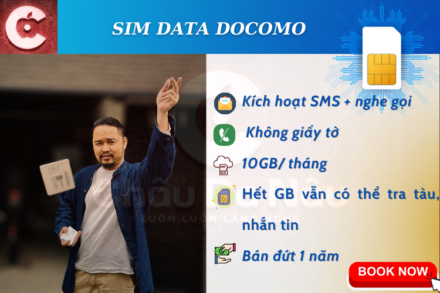
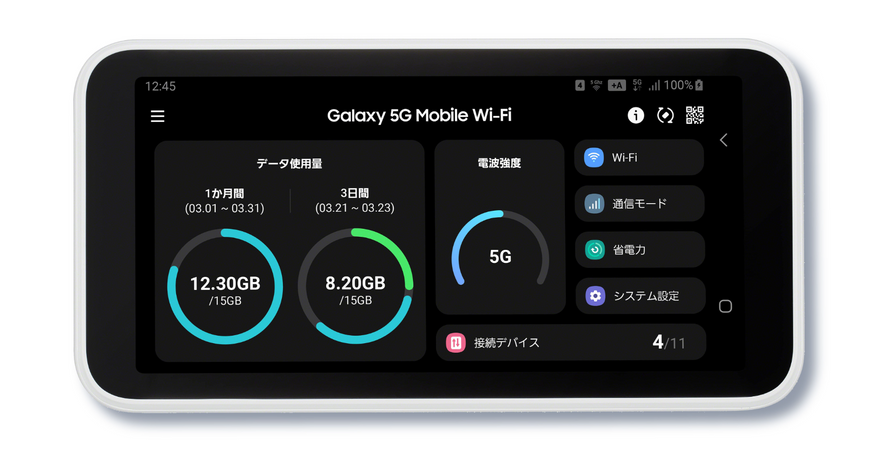
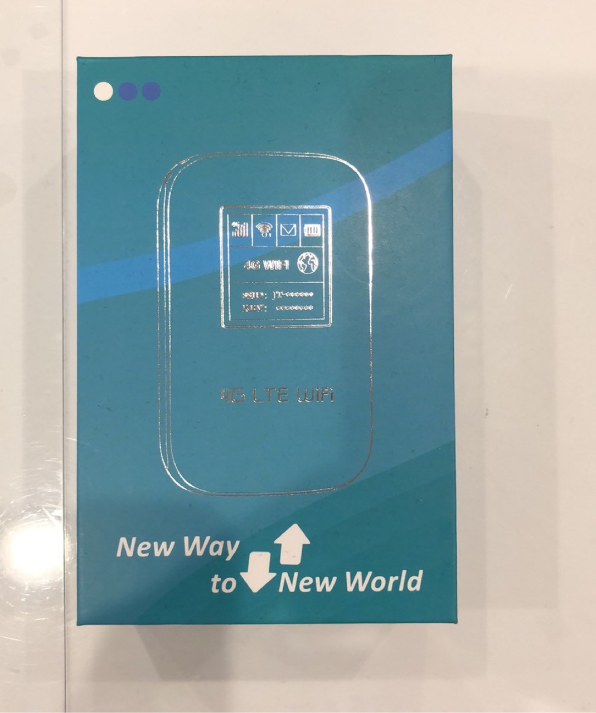
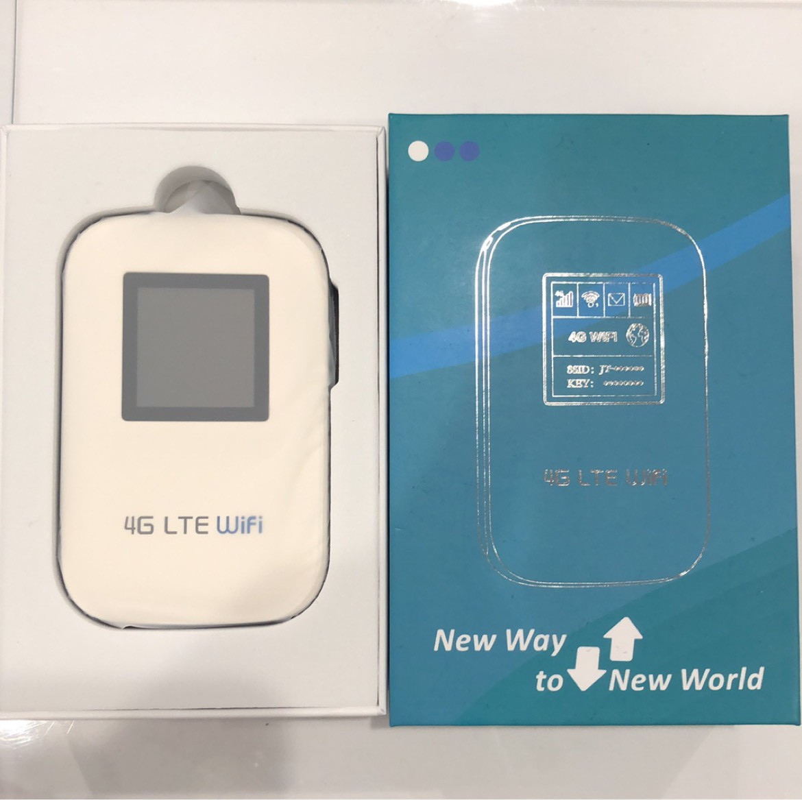

<!DOCTYPE html>
<html lang="vi" data-lang="vi">
<head>
  <meta charset="UTF-8">
  <meta name="viewport" content="width=device-width, initial-scale=1.0">
  <title>Châu Da Nâu - Shop SIM & WiFi Cầm Tay</title>
  
</head>
<body data-lang="vi">
  <!-- Header -->
  <header class="header">
    

      

        <a href="#">
          
          
            Châu Da Nâu
            Chau Da Nau
            チャウダナウ
          
        </a>
        <a href="https://www.tiktok.com/@chaudanau" target="_blank" class="tiktok">TikTok</a>
      

      <nav class="nav">
        <ul>
          <li><a href="#">Châu Da NâuHomeホーム</a></li>
          <li><a href="#sim-data">SIM DATASIM DATASIM データ</a></li>
          <li><a href="#wifi-cam-tay">WIFI CẦM TAYPortable WiFiポータブルWiFi</a></li>
          <li><a href="#ho-tro">HỖ TRỢSupportサポート</a></li>
        </ul>
      </nav>
      

        
        
        
      

    

  </header>
  

    <!-- Carousel Posters -->
    <section id="sim-data">
      

        
        
        
      

      <!-- SIM DATA SOFTBANK (Tháng) -->
      <h2 class="section-title">
        SIM DATA SOFTBANK (Tháng)
        SOFTBANK DATA SIM (Monthly)
        ソフトバンク データSIM（月額）
      </h2>
      

        <!-- Card 1 -->
        

          
          

            <h3>
              Softbank 100GB chia ngày
              Softbank 100GB per day
              ソフトバンク100GB/日
            </h3>
            <ul>
              <li>
                Nhận SMS
                Receive SMS
                SMS受信
              </li>
              <li>
                Chia ngày: ~3-4GB/ngày
                Daily quota: ~3-4GB/day
                日割り: 3～4GB/日
              </li>
            </ul>
            

              2.980 ¥ / tháng
              2,980 ¥ / month
              2,980円 / 月
            

            <a href="https://www.facebook.com/messages/t/Chaudanautiktok" class="btn" target="_blank">
              Liên hệ mua ngay
              Contact & Buy now
              今すぐ購入・お問い合わせ
            </a>
          

        

        <!-- Card 2 -->
        

          
          

            <h3>
              Softbank 100GB chia ngày
              Softbank 100GB per day
              ソフトバンク100GB/日
            </h3>
            <ul>
              <li>
                Nhận SMS
                Receive SMS
                SMS受信
              </li>
              <li>
                Chia ngày: ~3-4GB/ngày
                Daily quota: ~3-4GB/day
                日割り: 3～4GB/日
              </li>
            </ul>
            

              3.500 ¥ / tháng
              3,500 ¥ / month
              3,500円 / 月
            

            <a href="https://www.facebook.com/messages/t/Chaudanautiktok" class="btn" target="_blank">
              Liên hệ mua ngay
              Contact & Buy now
              今すぐ購入・お問い合わせ
            </a>
          

        

      

      <!-- SIM DATA SOFTBANK (Gói 1 năm) -->
      <h2 class="section-title">
        SIM DATA SOFTBANK (Gói 1 năm)
        SOFTBANK DATA SIM (1 year)
        ソフトバンク データSIM（1年）
      </h2>
      

        <button class="carousel-prev">&#8592;</button>
        

          <!-- 3GB -->
          

            
            

              <h3>
                Sim data <b>3 GB</b> nhà mạng SB
                Sim data <b>3 GB</b> Softbank
                SB 3GBデータSIM
              </h3>
              <ul>
                <li>Gói cước: 3GB/ThángPlan: 3GB/Monthプラン: 月3GB</li>
                <li>Miễn phí đăng kýNo registration fee登録無料</li>
                <li>Kích hoạt nghe gọi + SMSEnable call + SMS通話・SMS可</li>
              </ul>
              

                1 năm 6500¥
                1 year 6,500¥
                1年 6,500円
              

              <a href="https://www.facebook.com/messages/t/Chaudanautiktok" class="btn" target="_blank">
                Liên hệ mua ngay
                Contact & Buy now
                今すぐ購入・お問い合わせ
              </a>
            

          

          <!-- 5GB -->
          

            
            

              <h3>
                Sim data <b>5GB</b> nhà mạng SB
                Sim data <b>5GB</b> Softbank
                SB 5GBデータSIM
              </h3>
              <ul>
                <li>Gói cước: 5GB/ThángPlan: 5GB/Monthプラン: 月5GB</li>
                <li>Miễn phí đăng kýNo registration fee登録無料</li>
                <li>Kích hoạt nghe gọi + SMSEnable call + SMS通話・SMS可</li>
              </ul>
              

                1 năm 7800¥
                1 year 7,800¥
                1年 7,800円
              

              <a href="https://www.facebook.com/messages/t/Chaudanautiktok" class="btn" target="_blank">
                Liên hệ mua ngay
                Contact & Buy now
                今すぐ購入・お問い合わせ
              </a>
            

          

          <!-- 20GB -->
          

            
            

              <h3>
                Softbank 20GB/tháng
                Softbank 20GB/month
                ソフトバンク20GB/月
              </h3>
              <ul>
                <li>Miễn phí đăng kýNo registration fee登録無料</li>
                <li>Kích hoạt nghe gọi + SMSEnable call + SMS通話とSMS可能</li>
                <li>Tối đa 13 thángUp to 13 months最長13ヶ月</li>
              </ul>
              

                25.000 ¥ / năm
                25,000 ¥ / year
                25,000円 / 年
              

              <a href="https://www.facebook.com/messages/t/Chaudanautiktok" class="btn" target="_blank">
                Liên hệ mua ngay
                Contact & Buy now
                今すぐ購入・お問い合わせ
              </a>
            

          

          <!-- 100GB (chia ngày) -->
          

            
            

              <h3>
                Softbank 100GB/tháng (Chia ngày)
                Softbank 100GB/month (Daily quota)
                ソフトバンク100GB/月（日割り）
              </h3>
              <ul>
                <li>Miễn phí đăng kýNo registration fee登録無料</li>
                <li>Kích hoạt nghe gọi + SMSEnable call + SMS通話とSMS可能</li>
                <li>Chia ngày: ~3-4GB/ngàyDaily quota: ~3-4GB/day日割り: 3～4GB/日</li>
              </ul>
              

                34.500 ¥ / năm
                34,500 ¥ / year
                34,500円 / 年
              

              <a href="https://www.facebook.com/messages/t/Chaudanautiktok" class="btn" target="_blank">
                Liên hệ mua ngay
                Contact & Buy now
                今すぐ購入・お問い合わせ
              </a>
            

          

          <!-- 100GB (không chia ngày) -->
          

            
            

              <h3>
                Softbank 100GB/tháng
                Softbank 100GB/month
                ソフトバンク100GB/月
              </h3>
              <ul>
                <li>Miễn phí đăng kýNo registration fee登録無料</li>
                <li>Kích hoạt nghe gọi + SMSEnable call + SMS通話とSMS可能</li>
                <li>Không chia ngàyNo daily quota日割りなし</li>
              </ul>
              

                40.000 ¥ / năm
                40,000 ¥ / year
                40,000円 / 年
              

              <a href="https://www.facebook.com/messages/t/Chaudanautiktok" class="btn" target="_blank">
                Liên hệ mua ngay
                Contact & Buy now
                今すぐ購入・お問い合わせ
              </a>
            

          

        

        <button class="carousel-next">&#8594;</button>
      

            <!-- SIM DOCOMO VĨNH VIỄN -->
      <h2 class="section-title">
        SIM BÁN VĨNH VIỄN DOCOMO
        DOCOMO Lifetime SIM
        ドコモ 永久SIM
      </h2>
      

        

          
          

            <h3>
              Docomo 10GB/tháng
              Docomo 10GB/month
              ドコモ 10GB/月
            </h3>
            <ul>
              <li>
                Miễn phí đăng ký
                No registration fee
                登録無料
              </li>
              <li>
                Kích hoạt nghe gọi + SMS
                Enable call + SMS
                通話とSMS可能
              </li>
            </ul>
            

              14.500 ¥ / năm
              14,500 ¥ / year
              14,500円 / 年
            

            <a href="https://www.facebook.com/messages/t/Chaudanautiktok" class="btn" target="_blank">
              Liên hệ mua ngay
              Contact & Buy now
              今すぐ購入・お問い合わせ
            </a>
          

        

        

          
          

            <h3>
              Docomo 20GB/tháng
              Docomo 20GB/month
              ドコモ 20GB/月
            </h3>
            <ul>
              <li>
                Miễn phí đăng ký
                No registration fee
                登録無料
              </li>
              <li>
                Kích hoạt nghe gọi + SMS
                Enable call + SMS
                通話とSMS可能
              </li>
              <li>
                6 tháng: 14.000 ¥
                6 months: 14,000 ¥
                6ヶ月: 14,000円
              </li>
              <li>
                1 năm: 24.000 ¥
                1 year: 24,000 ¥
                1年: 24,000円
              </li>
            </ul>
            <a href="https://www.facebook.com/messages/t/Chaudanautiktok" class="btn" target="_blank">
              Liên hệ mua ngay
              Contact & Buy now
              今すぐ購入・お問い合わせ
            </a>
          

        

      

      <!-- WIFI CẦM TAY -->
      <h2 class="section-title" id="wifi-cam-tay">
        WIFI CẦM TAY
        Portable WiFi
        ポータブルWiFi
      </h2>
      

        

          
          

            <h3>
              WiFi 5G Full dung lượng
              5G Unlimited WiFi
              5G無制限WiFi
            </h3>
            <ul>
              <li>
                Kết nối tối đa 11 thiết bị
                Connect up to 11 devices
                最大11台接続
              </li>
              <li>
                Mạng 5G siêu mạnh
                Super fast 5G network
                超高速5G回線
              </li>
            </ul>
            

              4.989 ¥ / tháng
              4,989 ¥ / month
              4,989円 / 月
            

            <a href="https://www.facebook.com/messages/t/Chaudanautiktok" class="btn" target="_blank">
              Liên hệ mua ngay
              Contact & Buy now
              今すぐ購入・お問い合わせ
            </a>
          

        

        

          
          

            <h3>
              WiFi 100GB chia ngày
              100GB/day WiFi
              日割り100GB WiFi
            </h3>
            <ul>
              <li>
                Chia ngày: ~3-4GB/ngày
                Daily quota: ~3-4GB/day
                日割り: 3～4GB/日
              </li>
              <li>
                Pin 5-9 tiếng
                Battery 5-9 hours
                バッテリー 5～9時間
              </li>
              <li>
                1 đổi 1
                1 for 1 exchange
                1対1交換
              </li>
            </ul>
            <a href="https://www.facebook.com/messages/t/Chaudanautiktok" class="btn" target="_blank">
              Liên hệ mua ngay
              Contact & Buy now
              今すぐ購入・お問い合わせ
            </a>
          

        

        

          
          

            <h3>
              WiFi 100GB/tháng
              WiFi 100GB/month
              WiFi 100GB/月
            </h3>
            <ul>
              <li>
                Không chia ngày
                No daily quota
                日割りなし
              </li>
              <li>
                Pin 5-9 tiếng
                Battery 5-9 hours
                バッテリー 5～9時間
              </li>
              <li>
                1 đổi 1
                1 for 1 exchange
                1対1交換
              </li>
            </ul>
            

              3.500 ¥ / tháng
              3,500 ¥ / month
              3,500円 / 月
            

            <a href="https://www.facebook.com/messages/t/Chaudanautiktok" class="btn" target="_blank">
              Liên hệ mua ngay
              Contact & Buy now
              今すぐ購入・お問い合わせ
            </a>
          

        

      

    </section>

    <!-- Features -->
    <section class="features container" id="ho-tro">
      

        <!-- Bạn thêm các thẻ card với icon và mô tả như mẫu đã gửi ở trên -->
        <!-- Mình giữ lại đúng thông tin như bạn đã từng gửi -->
        

          
          <h3>
            Bảo mật thông tin
            Information Security
            情報セキュリティ
          </h3>
          

            Tất cả các thông tin của quý khách sẽ được bảo mật hoàn toàn từ online đến offline
            All customer information is fully protected online and offline
            お客様の情報はオンライン・オフライン問わず完全に保護されます
          

        

        

          
          <h3>
            Không giấy tờ hợp đồng
            No paperwork
            書類不要
          </h3>
          

            Không cần cung cấp giấy tờ thông tin cá nhân Bộ đội cũng có thể đăng ký không phí hủy
            No need to provide personal documents Soldiers can also register, no cancellation fee
            個人情報の書類不要 自衛隊も解約料なしで登録可
          

        

        

          
          <h3>
            Đăng ký nghe gọi
            Register for calls
            通話登録可
          </h3>
          

            Nhận SMS đăng ký ứng dụng, LINE, ZALO, FACEBOOK, MERIKARI
            Receive SMS for app registration, LINE, ZALO, FACEBOOK, MERIKARI
            アプリ登録用SMS受信可（LINE・ZALO・FACEBOOK・メルカリ）
          

        

        

          
          <h3>
            Hỗ trợ 24/7
            Support 24/7
            24時間サポート
          </h3>
          

            Đội ngũ hỗ trợ 24/7 Đồng hành cùng quý khách mãi mãi
            24/7 support team Always by your side
            24時間対応のサポートチーム いつでもサポートします
          

        

        

          
          <h3>
            Ship toàn Nhật Bản
            Nationwide Shipping (Japan)
            日本全国発送
          </h3>
          

            Nhận hàng chỉ sau 1-2 ngày đặt hàng
            Receive your order in 1-2 days
            ご注文から1〜2日でお届け
          

        

        

          
          <h3>
            Đổi trả
            Exchange
            交換保証
          </h3>
          

            Lỗi 1 đổi 1 trong vòng 5 ngày
            1 for 1 exchange within 5 days for errors
            不具合時は5日以内1対1交換
          

        

      

    </section>

    <!-- Contact & Address -->
    <section class="contact-section">
      

        

          <h3>
            Liên hệ
            Contact
            お問い合わせ
          </h3>
          

            Hotline: +81 7069403979 (A Châu)
            Hotline: +81 7069403979 (Mr. Chau)
            ホットライン: +81 7069403979（チャウさん）
          

        

        

          <h3>
            Địa chỉ
            Address
            住所
          </h3>
          

            〒169-0072 Tokyo Shinjuku Okubo 1-16-16 Shoei Bldg 101
            〒169-0072 Tokyo Shinjuku Okubo 1-16-16 Shoei Bldg 101
            〒169-0072 東京都新宿区大久保1-16-16 昇栄ビル101
          

          

            YouTube: <a href="https://www.youtube.com/@chaudanau" target="_blank">https://www.youtube.com/@chaudanau</a>
            YouTube: <a href="https://www.youtube.com/@chaudanau" target="_blank">https://www.youtube.com/@chaudanau</a>
            YouTube: <a href="https://www.youtube.com/@chaudanau" target="_blank">https://www.youtube.com/@chaudanau</a>
          

          

            TikTok: <a href="https://www.tiktok.com/@chaudanau" target="_blank">https://www.tiktok.com/@chaudanau</a>
            TikTok: <a href="https://www.tiktok.com/@chaudanau" target="_blank">https://www.tiktok.com/@chaudanau</a>
            TikTok: <a href="https://www.tiktok.com/@chaudanau" target="_blank">https://www.tiktok.com/@chaudanau</a>
          

        

      

    </section>
  

  <footer>
    

      &copy; 2025 Châu Da Nâu. All rights reserved.
      &copy; 2025 Chau Da Nau. All rights reserved.
      &copy; 2025 チャウダナウ. 無断転載を禁じます。
    

  </footer>
  
</body>
</html>

